# Chainguard on AKS: a hands-on comparison you can run yourself

One small web app, built twice: once on the usual `python:3.13-slim` base image,
once on a Chainguard image. You build both, scan both, look inside both, then
run both side by side on Azure Kubernetes Service behind an admission policy
that only lets trusted, signed images in. AKS is the destination; the local
steps exist so you can see the difference before it reaches a cluster.

No prior experience with container security is needed. Every step prints
something you can read, and this guide tells you what to look for.

## What you will end up with

| | upstream image | Chainguard image |
|---|---|---|
| base | `python:3.13-slim` (Debian) | `cgr.dev/chainguard/python` (Wolfi) |
| known CVEs (September 2026) | 178 | 5 |
| runs as | root | nonroot, uid 65532 |
| shell inside | yes | no |
| package manager inside | yes | no |
| OS packages | 87 | 26 |
| image size | 248 MB | 140 MB |

Your CVE numbers will differ, because both images are rebuilt all the time.
The gap between them is the point.

## Before you start

You need a Mac or Linux machine with:

- **Docker Desktop** running, with at least 5 GB of free disk. Check with `docker info`.
- **Homebrew** (`brew --version`). The tool installer uses it.
- **An Azure subscription** where you can create resource groups, and the Azure CLI logged in (`az login`).
- **About 35 minutes** end to end: 15 for the local checks, 20 for the AKS part, teardown included. The cluster costs around one US dollar per hour while it runs.

Clone the repo and install the scanners:

```bash
git clone https://github.com/sathpal/chainguard-aks-demo
cd chainguard-aks-demo
make tools        # installs trivy, grype, syft, cosign, crane; kubectl, helm, azure-cli if missing
```

## Part 1: build the evidence locally

Everything here runs against your local Docker and takes about 15 minutes.
It is the warm-up for Part 2: by the end you will know exactly what the two
images look like before you put them on a cluster. You can run all of it in
one go with `make demo`; the steps below do the same thing one at a time so
you can see what each one shows.

### Step 1. Build both images

```bash
make build
```

Two images appear, `demo-app:upstream` and `demo-app:chainguard`. The build
prints their sizes at the end. The Chainguard one is smaller because the base
image contains only what Python needs to run.

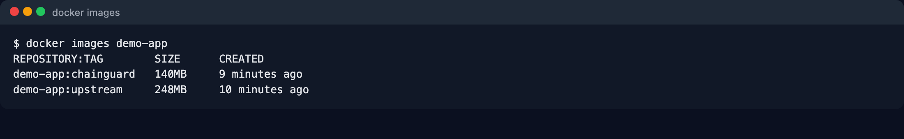

The two Dockerfiles are in [docker/](docker/). The Chainguard one is
multi-stage: dependencies are installed in a `-dev` image that has `pip` and a
shell, then copied into the minimal runtime image that has neither.

### Step 2. Scan for vulnerabilities

```bash
make scan
```

This runs `grype` (and `trivy` if installed) on both images and ends with a
one-line-per-image table:

```
IMAGE          SIZE  TOTAL   CRIT   HIGH    MED    LOW  USER       SHELL  PKGMGR
upstream      248MB    178      7     61     58     52  root       yes    yes
chainguard    140MB      5      0      1      2      2  nonroot    no     no
```

What to look for: the `TOTAL` and `CRIT` columns. None of those CVEs are in the
app code, which is identical in both images. They all come from the operating
system layer underneath.

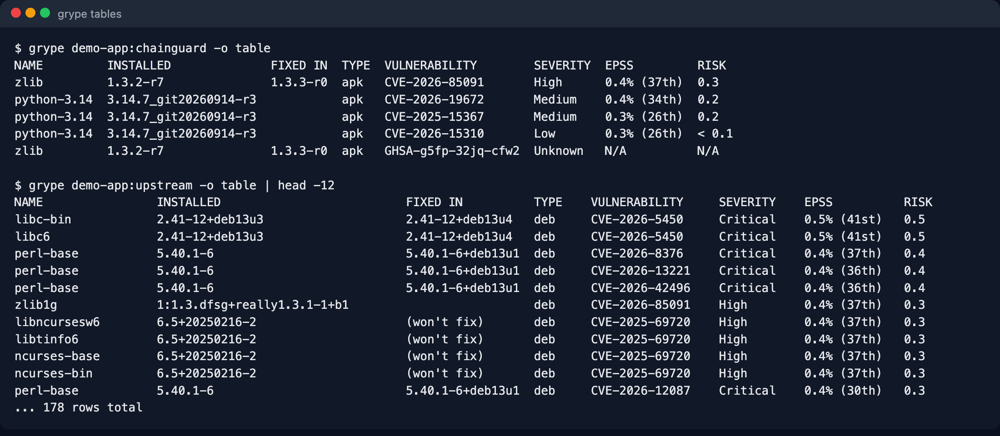

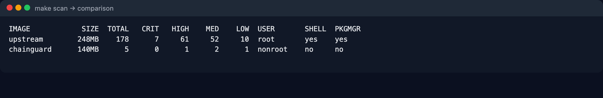

Full scan output is saved under `out/` as JSON and text.

### Step 3. Prove the base image is really from Chainguard

```bash
make verify
```

Chainguard signs every image with Sigstore. This checks the signature against
Chainguard's public release identity and prints the issuer, the identity and
the image digest. No keys or accounts needed.

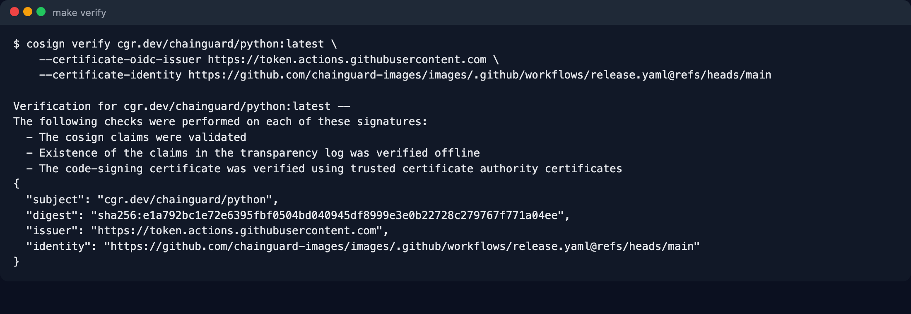

### Step 4. Software bill of materials

```bash
make sbom
```

Generates an SBOM for each of your images with `syft` and prints the package
count, then fetches the SBOM Chainguard already published and signed for the
base image. Fewer packages means a shorter list to check when the next big
CVE lands.

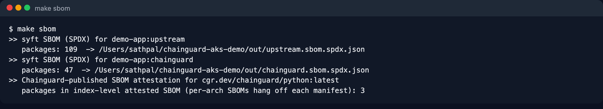

### Step 5. A one-page report

```bash
make report        # writes out/report.html and opens it (macOS)
```

On Linux, open `out/report.html` in a browser yourself.

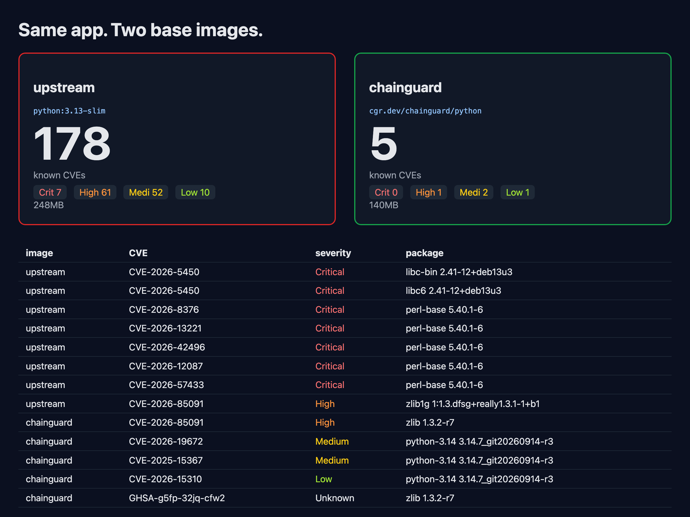

### Step 6. Run both and look inside

```bash
make run
```

Open http://localhost:8081 (upstream) and http://localhost:8082 (Chainguard).
The page reports what the app is running on: OS name, user id, whether a shell
exists, how many OS packages are installed.

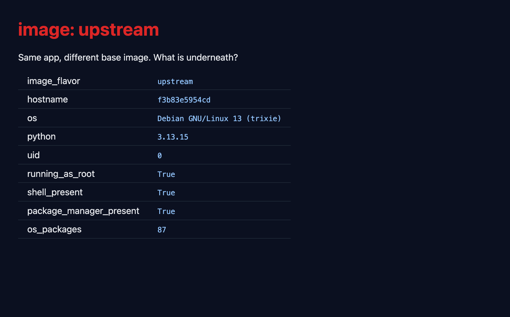

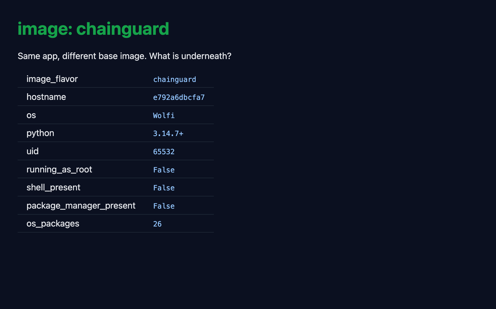

Now try to get a shell in each:

```bash
docker exec -it demo-upstream sh        # works: root prompt, apt-get available
docker exec -it demo-chainguard sh      # fails: there is no shell to run
```

That second failure is the security feature. Someone who gets code execution
inside the Chainguard container has no shell, no package manager and no root.

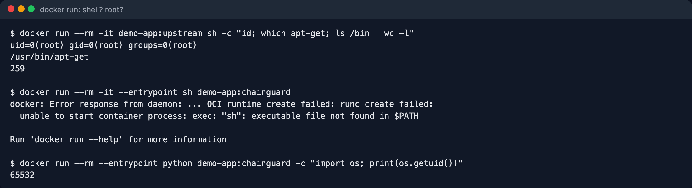

```bash
make stop
```

## Part 2: on Azure Kubernetes Service

This is the main part. You push both images to your own registry, deploy them
side by side on a two-node AKS cluster, call them through public IPs, and put
Kyverno in front so only trusted, signed images are admitted. It creates real
resources that cost money, around one US dollar per hour, and ends with the
command that deletes everything.

### Step 1. Configure names

```bash
cp .env.example .env
```

Edit `.env`:

- `ACR` must be globally unique, lowercase letters and numbers only, 5 to 50 characters. Check with `az acr check-name -n <name>`.
- `LOCATION` is any Azure region.
- `NODE_SIZE` is the VM size for the cluster nodes. The default is `Standard_D2s_v4`. If your subscription refuses it, see Troubleshooting.

### Step 2. Log in and pick a subscription

```bash
az login
az account list -o table          # find the subscription you want to use
az account set -s <subscription-id-or-name>
az account show                   # confirm before creating anything
```

### Step 3. Create the registry and the cluster

```bash
make aks-up       # resource group + registry + cluster, about 6 minutes
```

The last line lists two nodes in `Ready` state. Your `kubectl` is now pointed
at the new cluster.

### Step 4. Push the images

```bash
make acr-push     # builds for linux/amd64 and pushes both images to your registry
```

If Docker on your machine is unhappy, or you are on Apple Silicon and the
cross-build is slow, let Azure build it instead:

```bash
az acr build -r <your-acr-name> -f docker/Dockerfile.chainguard -t demo-app:chainguard --platform linux/amd64 .
az acr build -r <your-acr-name> -f docker/Dockerfile.upstream   -t demo-app:upstream   --platform linux/amd64 .
```

### Step 5. Deploy both

```bash
make deploy
```

Both deployments come up, each with its own public IP. Wait a minute for the
`EXTERNAL-IP` column to fill in, then call the app:

```bash
kubectl -n chainguard-demo get svc
curl http://<upstream-ip>/api
curl http://<chainguard-ip>/api
```

Compare the two JSON answers: `uid`, `shell_present`, `os_packages`.

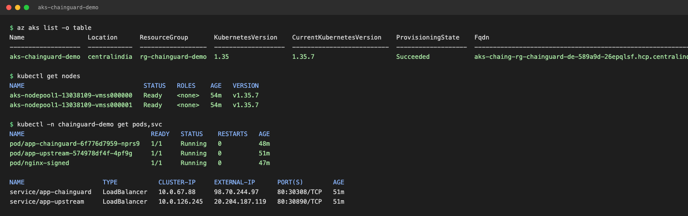

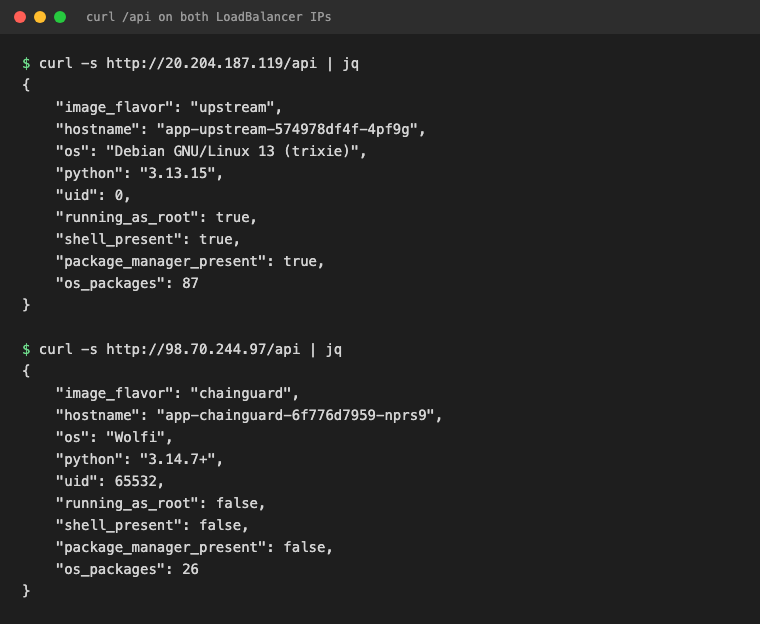

The same page you saw on localhost, now served from the cluster:

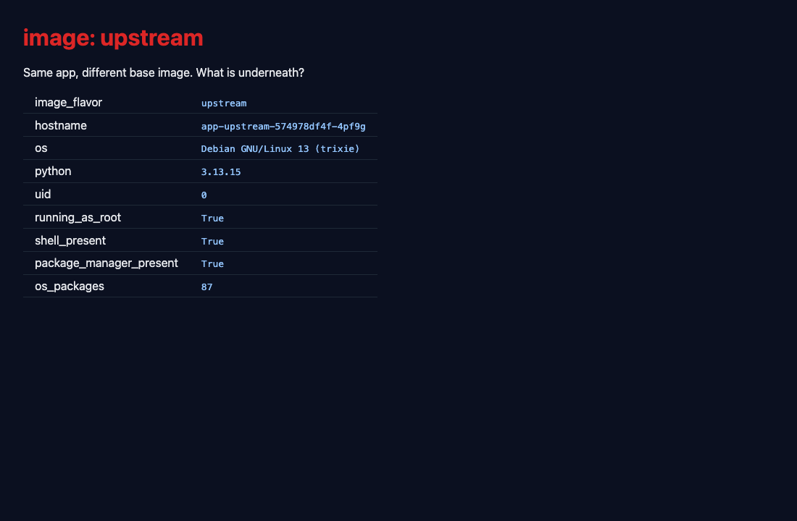

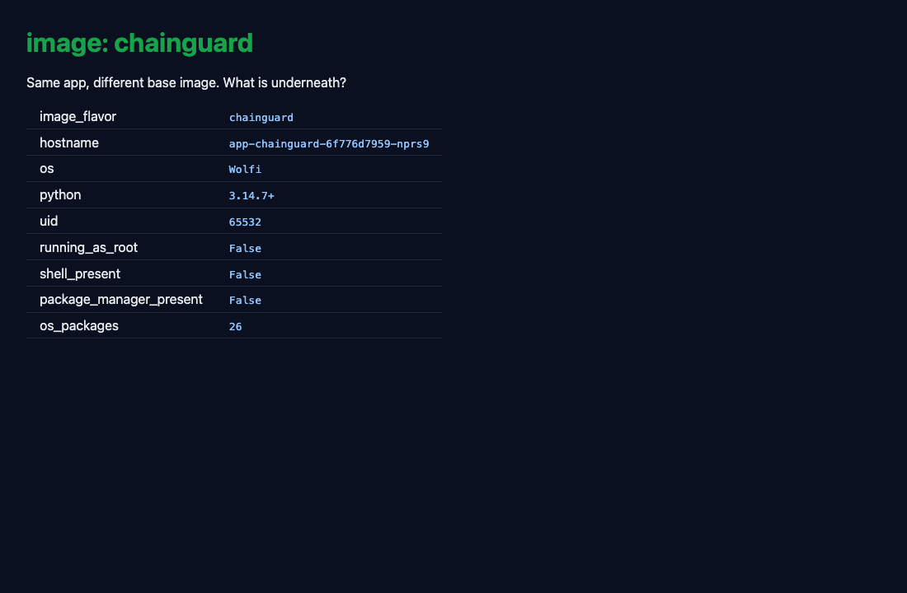

Look at [k8s/deploy-chainguard.yaml](k8s/deploy-chainguard.yaml). It turns on
every hardening option Kubernetes offers, including a read-only root
filesystem and dropping all capabilities. Try the same block on the upstream
deployment and it will not start, because that image runs as root.

### Step 6. Enforce it with an admission policy

```bash
make policy
```

This installs Kyverno and two cluster policies:

- Only images from `cgr.dev` or your own registry may run in the demo namespace.
- Every `cgr.dev/chainguard/*` image must carry Chainguard's Sigstore signature.

The script ends by trying to run plain `nginx` from Docker Hub. The API server
rejects it and prints which policy said no. Now admit a signed image:

```bash
kubectl apply -f k8s/pod-chainguard-nginx.yaml
kubectl -n chainguard-demo get pod nginx-signed      # Running
```

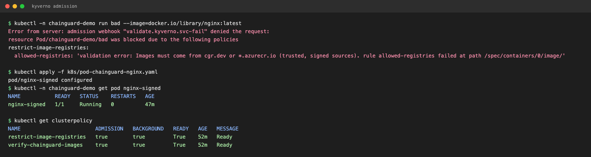

### Step 7. Debugging without a shell

`kubectl exec ... sh` does not work on the Chainguard pod. Use an ephemeral
debug container instead:

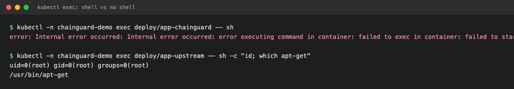

```bash
kubectl -n chainguard-demo debug -it deploy/app-chainguard --image=cgr.dev/chainguard/wolfi-base --target=app
```

### Step 8. Delete everything

```bash
make aks-down     # deletes the resource group, including the cluster's own node group
```

## Part 3: let an AI agent do the migration

The steps in Part 1 are packaged as a [Claude Code](https://claude.com/claude-code)
skill in [.claude/skills/chainguard-migrate/](.claude/skills/chainguard-migrate/).
Open this repo in Claude Code and say:

> use the chainguard-migrate skill on docker/Dockerfile.upstream

The agent scans the current image, rewrites the Dockerfile to the multi-stage
Chainguard pattern using the base-image map in the same folder, rebuilds,
rescans, verifies the signature and prints the before-and-after table. Its last
rule: never claim a CVE count without a fresh scan in the transcript.

A reference CI pipeline that does build, SBOM, scan gate, keyless signing and
push to a registry is in [.github/workflows/supply-chain.yml](.github/workflows/supply-chain.yml).
It is set to manual trigger and needs Azure OIDC secrets before it can run.

## Prefer typing every command yourself?

[docs/hands-on-lab.md](docs/hands-on-lab.md) is this whole demo without the Makefile:
each step as raw commands, the output you should see, and the one-line explanation.

## Part 4: the rest of what ships with a Chainguard image

Everything above used the signature and the SBOM. An image on cgr.dev carries more,
and none of it needs an account. One target runs it all:

```bash
make extend
```

What it shows, in order:

1. **Everything attached to the image** (`cosign tree`): one signature, three attestations.
2. **The three attestations, each verified against Chainguard's release identity:** the
   SPDX SBOM, SLSA v1 provenance (who built it, with what build type), and the apko
   configuration, which is the exact package list the image was assembled from.
3. **Daily rebuilds:** the digest and build timestamp of today's `latest`. Run it again
   tomorrow and both change. Only `latest` and `latest-dev` exist without an account;
   version tags are a catalog feature.
4. **The Wolfi security feed:** for the packages behind the remaining CVEs, the latest
   fixed release and how many CVEs that package has had fixed. This is the data grype
   uses to say "fixed" or "not yet".
5. **dfc, Chainguard's Dockerfile converter,** run on the upstream Dockerfile. It swaps
   the base for a catalog image in one step. Compare its single-stage output with the
   multi-stage file in `docker/`.
6. **apko, the tool Chainguard builds its own images with.** [apko/python-custom.yaml](apko/python-custom.yaml)
   assembles a Python image from Wolfi packages plus one extra package, in about ten
   seconds, with an SBOM written next to it and no Dockerfile. This is what "custom
   assembly" means in the paid catalog, done by hand.

Steps 5 and 6 need two more tools. Homebrew has them (`brew install chainguard-dev/tap/dfc apko`),
or download the release binaries from
[chainguard-dev/dfc](https://github.com/chainguard-dev/dfc/releases) and
[chainguard-dev/apko](https://github.com/chainguard-dev/apko/releases). Docker must be running
for step 6.

`chainctl`, the account CLI (image diff, image history, pull tokens, identity
federation for private registries), needs a free Chainguard account and a browser login,
so it is not in the script. Install it with `brew install chainguard-dev/tap/chainctl`
and run `chainctl auth login`.

## Troubleshooting

**`az aks create` says the VM size is not allowed or quota is insufficient.**
Every subscription has different limits. List what yours allows in your region:

```bash
az vm list-usage -l <region> -o table        # families with quota
az vm list-skus -l <region> --size Standard_D2 -o table   # sizes available
```

Pick a 2 vCPU size with quota and set `NODE_SIZE` in `.env`.

**`az acr create` says the name is taken.** Registry names are global across
all of Azure. Choose another.

**`az acr build` fails with `Permission denied: '/app/venv'`.** ACR Tasks uses
Docker's legacy builder, which creates `WORKDIR` as root even though the
Chainguard `-dev` image runs as nonroot. The Dockerfile in this repo already
works around it by building inside `/home/nonroot`. If you write your own,
do the same.

**Pod stuck in `CreateContainerConfigError` with "image has non-numeric user".**
Kubernetes cannot verify `runAsNonRoot` when the image sets its user by name.
Either write `USER 65532` in the Dockerfile or set `runAsUser: 65532` in the
pod spec. This repo does both, so the image is correct on its own and the
manifest still guards against a future image that is not.

**`brew install` says "Your Command Line Tools are too outdated".**
Run `xcode-select --install`, or skip Homebrew and download the release binary for the tool.

**Docker fails with "input/output error" or "no space left".** Your disk is
full. Free space, restart Docker Desktop, then `docker builder prune -af`.

**On Apple Silicon, `make acr-push` is slow.** It cross-builds for
`linux/amd64` because AKS nodes are x86. Use `az acr build` as shown in
Part 2, Step 4.

## What is in the repo

```
app/                 the FastAPI app; / shows a page, /api returns JSON, /healthz for probes
docker/              Dockerfile.upstream and Dockerfile.chainguard
scripts/             one script per step; the Makefile just calls them
apko/                a declarative image definition for the apko step in Part 4
k8s/                 namespace, two deployments with services, Kyverno policies, signed test pod
.claude/skills/      the chainguard-migrate agent skill and its base-image map
.github/workflows/   reference supply-chain pipeline
docs/img/            the screenshots used in this README
out/                 scan results, SBOMs and the HTML report (created by the scripts, not committed)
```

## Where the numbers come from

Everything in the table at the top was produced by running this repo, not
copied from a vendor page. Run it again and you will get today's numbers.
